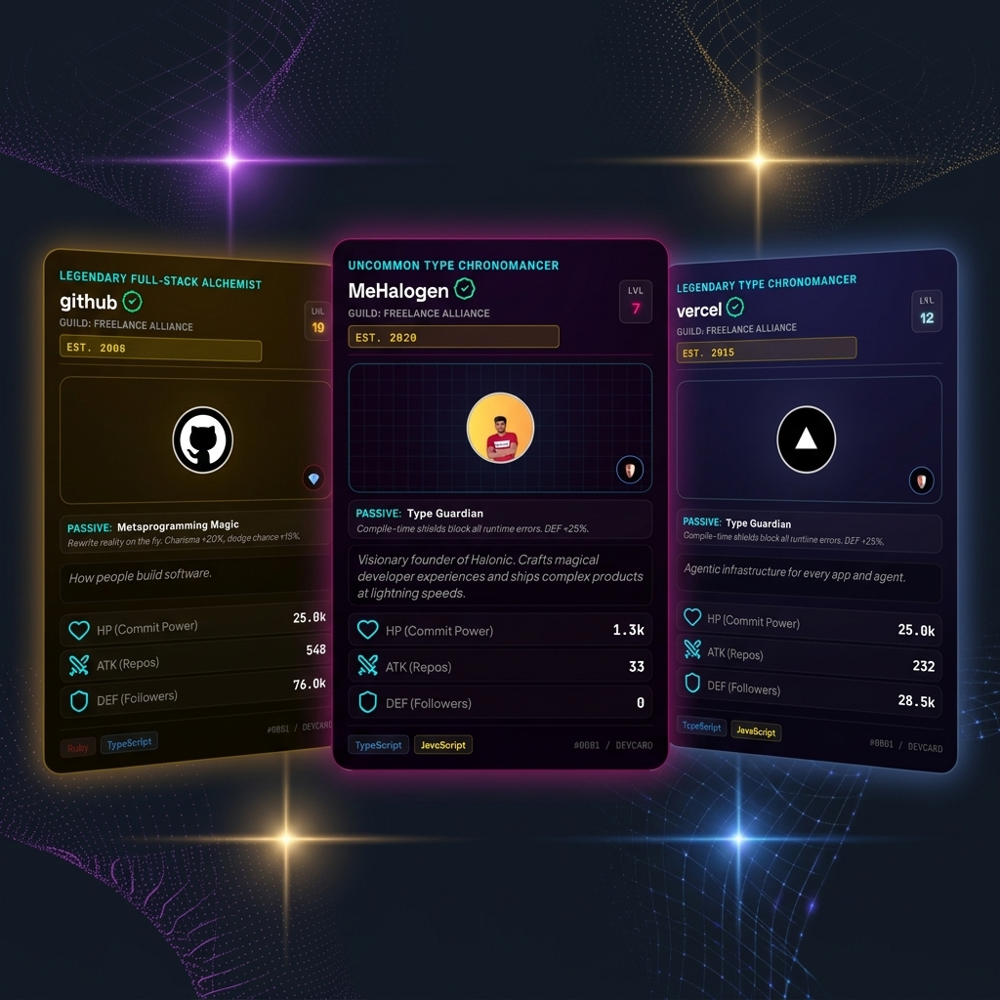

# 🎴 DevCard 3D

[](https://devcard-3d.vercel.app)
[](LICENSE)
[](app.js)

Turn your GitHub profile statistics into interactive, mouse-tilting 3D holographic trading cards. Think Pokémon cards meet developer portfolios.



---

## 📖 Deep-Dive Article

I wrote a comprehensive technical write-up detailing the CSS 3D transforms, holographic blend modes, and anti-cheat database verification used in this project:

👉 **[Read the Full Technical Deep-Dive on Dev.to](https://dev.to/mehalogen)** *(Replace this with your exact published Dev.to URL!)*

---

## ✨ Features

- 🌈 **5 Premium Holographic Themes:** Classic Foil, Neon Cyber, Solar Gold, Obsidian Shadow, and Ethereal Glass.
- ⚡ **Pure CSS 3D Transforms:** Smooth, fluid 60fps card rotations and interactive mouse shimmer effects (no WebGL or Three.js overhead).
- 🏆 **Anti-Cheat Leaderboard:** OAuth-verified developer rankings using Supabase to secure real, uninflated stats.
- 💾 **Instant Exporter:** Save your generated card instantly as a high-fidelity PNG or copy responsive iframe embed codes.
- 🎨 **Creative Mode Customizer:** Manually override stats, choose custom bio descriptions, elements, and secondary languages.
- 📱 **Mobile Optimized:** Full viewport scaling specifically refined for viewports down to iPhone 14 dimensions without horizontal overflow.

---

## 🛠️ RPG Attribute Mapping

Your GitHub contributions are translated into classic RPG battle stats:
- **HP (Commit Power):** Total contributions weighted by activity ratio.
- **ATK (Public Repos):** Total number of open-source repositories.
- **DEF (Followers):** Profile follower count.
- **LVL (Years Active):** Number of active years on GitHub.
- **Affinities & Class:** Calculated from your top programming languages.

---

## 🚀 Quick Start / Development

This project is built purely with **Vanilla JS and CSS**, meaning there are no complex framework build steps. You can run it instantly:

1. Clone the repository:
   ```bash
   git clone https://github.com/MeHalogen/devcard-3d.git
   cd devcard-3d
   ```

2. Open `index.html` directly in your browser, or start a local dev server:
   ```bash
   npx serve .
   ```

---

## 💜 Contributing

Contributions are welcome! Please feel free to open issues or submit Pull Requests for:
- New card themes
- Advanced element animations
- Leaderboard features

---

## 📄 License

This project is open-source and licensed under the **MIT License**.
